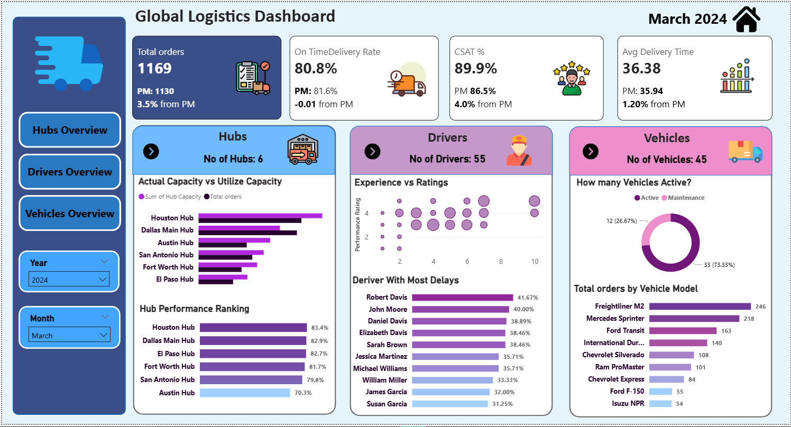

# 🚚 Global Logistics Dashboard - Power BI Analytics Project



> **A comprehensive end-to-end Power BI solution for logistics operations analytics, tracking 1,169+ orders across multiple hubs, drivers, and vehicles.**

[](https://powerbi.microsoft.com/)
[](https://dax.guide/)
[](https://github.com)

---

## 📋 Table of Contents
- [Project Overview](#-project-overview)
- [Key Features](#-key-features)
- [Dashboard Views](#-dashboard-views)
- [Data Model](#-data-model)
- [Key Metrics & DAX Measures](#-key-metrics--dax-measures)
- [Insights & Findings](#-insights--findings)
- [Technical Stack](#-technical-stack)
- [Installation & Setup](#-installation--setup)
- [Screenshots](#-screenshots)
- [Future Enhancements](#-future-enhancements)
- [Contact](#-contact)

---

## 🎯 Project Overview

This Power BI dashboard provides comprehensive analytics for a global logistics operation, enabling data-driven decision-making across hub management, driver performance, and fleet optimization.

### Business Objectives:
- Monitor operational KPIs in real-time
- Optimize hub capacity utilization
- Track and improve driver performance
- Maximize fleet efficiency
- Enhance customer satisfaction through delivery insights

### Project Highlights:
- **1,169** Total Orders Tracked
- **6** Distribution Hubs Monitored
- **55** Drivers Analyzed
- **45** Vehicles Managed
- **4** Interactive Dashboard Pages

---

## ✨ Key Features

### 📊 Executive Dashboard
- Real-time KPI monitoring with Previous Month (PM) comparisons
- On-Time Delivery Rate tracking
- Customer Satisfaction (CSAT) scoring
- Average Delivery Time analysis
- Dynamic date filtering (Year/Month slicers)

### 🏢 Hubs Analytics
- Capacity vs. Utilization comparison
- Hub performance ranking
- Geographic distribution analysis
- Bottleneck identification

### 👨‍✈️ Driver Performance
- Experience vs. Rating correlation analysis
- Delay percentage calculations
- Performance ranking system
- Training opportunity identification

### 🚗 Fleet Management
- Active vs. Maintenance status tracking
- Orders by vehicle model analysis
- Fleet utilization metrics
- Procurement decision support

---

## 📱 Dashboard Views

### 1. **Main Dashboard** (Executive Summary)
The landing page provides a bird's-eye view of all critical metrics:
- Total Orders with PM variance
- On-Time Delivery Rate (80.8%)
- CSAT Score (89.9%)
- Average Delivery Time (36.38 hours)
- Hub performance summary
- Driver rankings
- Fleet status overview

### 2. **Hubs Overview**
Deep-dive into distribution center operations:
- Actual vs. Utilized capacity charts
- Hub performance rankings by efficiency
- Processing time analysis
- Capacity planning insights

### 3. **Drivers Overview**
Comprehensive workforce analytics:
- Experience vs. Performance bubble charts
- Delay rate rankings
- Individual driver metrics
- Coaching & training recommendations

### 4. **Vehicles Overview**
Fleet management intelligence:
- Active vs. Maintenance breakdown
- Orders by vehicle model
- Fleet age analysis
- Maintenance scheduling insights

---

## 🗂️ Data Model

### Star Schema Design

```
          ┌─────────────┐
          │  Date Table │
          └──────┬──────┘
                 │
                 │ (1:Many)
                 │
    ┌────────────▼────────────┐
    │                         │
┌───┴────┐            ┌───────▼──────┐
│ Hubs   │            │   Orders     │◄──────┐
└───┬────┘            │  (Fact)      │       │
    │                 └───────┬──────┘       │
    │ (1:Many)               │               │
    │                        │ (Many:1)      │ (Many:1)
    │                        │               │
    │                 ┌──────▼──────┐ ┌──────┴──────┐
    └─────────────────┤   Drivers   │ │  Vehicles   │
                      └─────────────┘ └─────────────┘
```

### Table Structures:

#### 📅 **Date Table** (Dimension)
- Date
- Day
- Day No
- Month
- Month No
- Year

#### 🏢 **Hubs** (Dimension)
- Hub ID
- Hub Name
- Hub Capacity
- Location

#### 👨‍✈️ **Drivers** (Dimension)
- Driver ID
- Driver Name
- Employment Type
- Experience Years
- Hire Date
- Performance Rating

#### 🚗 **Vehicles** (Dimension)
- Vehicle ID
- Vehicle Code
- Vehicle Model
- Vehicle Age
- Purchase Date
- Breakdown Status
- Maintenance Count Alert

#### 📦 **Orders** (Fact Table)
- Order ID
- Actual Delivery Date
- Delivery Time Hours
- Customer Satisfaction Score
- Delay Reason
- Is Delayed
- Hub Processing Time Hours
- Driver ID (FK)
- Hub Name (FK)
- Vehicle ID (FK)

---

## 📐 Key Metrics & DAX Measures

### Core KPIs

#### 1. **Total Orders**
```dax
Total Orders = COUNTROWS(Orders)
```

#### 2. **On-Time Delivery Rate**
```dax
On Time Delivery % = 
DIVIDE(
    CALCULATE(
        COUNTROWS(Orders),
        Orders[Is Delayed] = FALSE
    ),
    COUNTROWS(Orders),
    0
) * 100
```

#### 3. **Customer Satisfaction Score**
```dax
CSAT % = 
AVERAGE(Orders[Customer Satisfaction Score]) * 100
```

#### 4. **Average Delivery Time**
```dax
Avg Delivery Time = 
AVERAGE(Orders[Delivery Time Hours])
```

### Time Intelligence Measures

#### Previous Month Comparison
```dax
PM Total Orders = 
CALCULATE(
    [Total Orders],
    PREVIOUSMONTH('Date Table'[Date])
)

Orders Variance from PM = 
DIVIDE(
    [Total Orders] - [PM Total Orders],
    [PM Total Orders],
    0
) * 100
```

### Advanced Analytics Measures

#### Driver Delay Percentage
```dax
Driver Delay % = 
DIVIDE(
    CALCULATE(
        COUNTROWS(Orders),
        Orders[Is Delayed] = TRUE
    ),
    COUNTROWS(Orders),
    0
) * 100
```

#### Hub Capacity Utilization
```dax
Hub Utilization % = 
DIVIDE(
    [Total Orders],
    MAX(Hubs[Hub Capacity]),
    0
) * 100
```

#### Fleet Active Count
```dax
Active Vehicles = 
CALCULATE(
    COUNTROWS(Vehicles),
    Vehicles[Breakdown] = "Active"
)
```

---

## 💡 Insights & Findings

### Key Takeaways (March 2024):

#### 📈 Performance Metrics
- **Customer Satisfaction**: 89.9% (+4.0% from previous month) - Excellent upward trend
- **On-Time Delivery**: 80.8% (-0.8% from target) - Slight gap requiring attention
- **Order Volume**: 1,169 orders (3.5% growth) - Healthy business expansion

#### 🏢 Hub Performance
1. **Houston Hub**: Leading at 83.4% efficiency - Best practices model
2. **Dallas Main Hub**: Strong at 82.9% - Consistent performer
3. **Austin Hub**: 70.3% - Potential for capacity reallocation

#### 👨‍✈️ Driver Insights
- Strong correlation between experience and performance ratings
- Top performer: Susan Garcia (31.25% delay rate)
- Coaching opportunity: Robert Davis (41.67% delay rate)
- Average experience level suggests mature workforce

#### 🚗 Fleet Analysis
- **73.33%** Active utilization - Healthy operational rate
- **Freightliner M2**: Workhorse model with 246 deliveries
- **Mercedes Sprinter**: Reliable with 218 deliveries
- Maintenance scheduling prevents 26.67% downtime

---

## 🛠️ Technical Stack

| Technology | Purpose |
|-----------|---------|
| **Power BI Desktop** | Dashboard development & visualization |
| **DAX** | Calculated measures & time intelligence |
| **Power Query** | Data transformation & cleaning |
| **Star Schema** | Data modeling for optimal performance |
| **Excel/CSV** | Source data format |

---

## 💻 Installation & Setup

### Prerequisites
- Power BI Desktop (Latest version recommended)
- Windows 10 or later
- Minimum 4GB RAM

### Steps to Run

1. **Clone the repository**
   ```bash
   git clone https://github.com/YOUR_USERNAME/global-logistics-dashboard.git
   cd global-logistics-dashboard
   ```

2. **Open the Power BI file**
   ```
   Double-click on "Global_Logistics_Dashboard.pbix"
   ```

3. **Refresh data** (if using sample data)
   - Click on "Refresh" in the Home ribbon
   - Ensure data source paths are correctly configured

4. **Explore the dashboard**
   - Use the navigation buttons on the left sidebar
   - Apply filters using Year/Month slicers
   - Click on any visual for cross-filtering

### File Structure
```
global-logistics-dashboard/
│
├── Global_Logistics_Dashboard.pbix    # Main Power BI file
├── data/                               # Sample data files
│   ├── orders.csv
│   ├── drivers.csv
│   ├── hubs.csv
│   ├── vehicles.csv
│   └── date_table.csv
├── screenshots/                        # Dashboard images
│   ├── main_dashboard.png
│   ├── data_model.png
│   ├── hubs_view.png
│   ├── drivers_view.png
│   └── vehicles_view.png
├── documentation/
│   ├── DAX_Measures.md                # All DAX formulas
│   └── Data_Dictionary.md             # Column descriptions
└── README.md                          # This file
```

---

## 📸 Screenshots

### Main Dashboard


### Data Model


### Hubs Overview


### Drivers Performance


### Vehicles Management


---

## 🚀 Future Enhancements

### Planned Features:
- [ ] Real-time data integration via Power BI Service
- [ ] Predictive analytics for delivery time estimation
- [ ] Route optimization algorithms
- [ ] Mobile app responsive design
- [ ] Automated email alerts for KPI thresholds
- [ ] Integration with GPS tracking systems
- [ ] Machine learning for demand forecasting
- [ ] Cost analysis dashboard (fuel, maintenance, labor)

### Stretch Goals:
- [ ] Python/R integration for advanced analytics
- [ ] Custom visuals for route mapping
- [ ] Row-level security for multi-tenant access
- [ ] REST API integration for live updates

---

## 📚 Learning Resources

This project demonstrates proficiency in:
- ✅ Data modeling (Star Schema design)
- ✅ DAX (Time intelligence, calculated measures)
- ✅ Power Query (Data transformation)
- ✅ Visual design & UX principles
- ✅ Business intelligence & analytics thinking

### Recommended Learning Path:
1. [Power BI Fundamentals](https://learn.microsoft.com/en-us/power-bi/)
2. [DAX Guide](https://dax.guide/)
3. [Power Query M Reference](https://learn.microsoft.com/en-us/powerquery-m/)
4. [Dashboard Design Best Practices](https://powerbi.microsoft.com/en-us/blog/)

---

## 🤝 Contributing

Contributions, issues, and feature requests are welcome!

1. Fork the project
2. Create your feature branch (`git checkout -b feature/AmazingFeature`)
3. Commit your changes (`git commit -m 'Add some AmazingFeature'`)
4. Push to the branch (`git push origin feature/AmazingFeature`)
5. Open a Pull Request

---

## 📄 License

This project is licensed under the MIT License - see the [LICENSE](LICENSE) file for details.

---

## 📧 Contact

**Your Name** - Data Analyst

[](https://linkedin.com/in/YOUR_PROFILE)
[](mailto:your.email@example.com)
[](https://yourportfolio.com)
[](https://github.com/YOUR_USERNAME)

---

## ⭐ Show Your Support

If this project helped you learn something new or solve a problem, please give it a ⭐️!

---

## 🙏 Acknowledgments

- Power BI community for inspiration
- Microsoft Learn for comprehensive documentation
- Data analytics professionals who shared their knowledge

---

<div align="center">
  
**Built with ❤️ using Power BI**

*Last Updated: April 2026*

</div>
